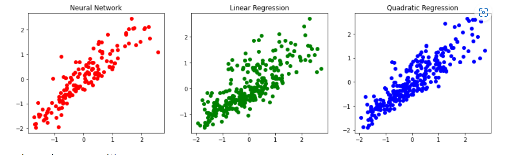

# Project Name

## Description
This project focuses on hyperparameter optimization for a single-layer neural network and compares its performance with linear regression and quadratic regression. By fine-tuning the hyperparameters of the neural network, we aim to achieve improved results in terms of Mean Squared Error (MSE) and R2 score.

## Table of Contents
- [Installation](#installation)
- [Usage](#usage)
- [Hyperparameter Optimization](#hyperparameter-optimization)
- [Comparison with Linear Regression and Quadratic Regression](#comparison-with-linear-regression-and-quadratic-regression)
- [Conclusion](#conclusion)
- [Contributing](#contributing)
- [License](#license)

## Installation
To run this project, you need to have the following dependencies installed:

- Python 
- NumPy 
- Pandas 
- Scikit-learn 

Clone this repository to your local machine:

```bash
https://github.com/shouvikghorui7/Hyperparameter-optimization-of-neural-network.git
```

## Usage
1. Navigate to the project directory.
2. Open the main script file (`Hyperparameter optimization Single layer neural network.ipynb`).
3. Modify the necessary parameters and configurations based on your requirements.
4. Run the script to execute the experiments and obtain the results.

## Hyperparameter Optimization
The hyperparameter optimization process in this project involves finding the optimal values for various hyperparameters of the single-layer neural network. These hyperparameters may include learning rate, number of hidden units, activation function, etc. The optimization technique used can be grid search, random search, or any other suitable method.
Here I have optimized the number of neurons in a single-layer neural network

During the optimization process, the neural network is trained and evaluated using different combinations of hyperparameter values. The aim is to identify the set of hyperparameters that minimizes the loss function and enhances the overall performance of the network.

## Comparison with Linear Regression and Quadratic Regression
After obtaining the optimized single-layer neural network, we compared its performance with that of linear regression and quadratic regression models. The evaluation was based on two metrics: Mean Squared Error (MSE) and R2 score.

The MSE measures the average squared difference between the predicted and actual values. A lower MSE indicates better predictive accuracy. The R2 score measures the proportion of the variance in the dependent variable that can be explained by the independent variables. A higher R2 score indicates better goodness of fit.

Upon comparison, it was observed that the neural network achieved a lower MSE error and a higher R2 score compared to both linear regression and quadratic regression. These results indicate that the neural network is better suited for this particular case studied.
## Comparison Images

## Conclusion
In this project, we successfully performed hyperparameter optimization for a single-layer neural network. By fine-tuning the hyperparameters, we achieved improved performance in terms of MSE error and R2 score. The optimized neural network outperformed both linear regression and quadratic regression models, making it the most suitable choice for the specific case under consideration.

## Contributing
We welcome contributions to enhance the functionality and features of this project. To contribute, please follow these steps:
1. Fork this repository.
2. Create a new branch.
3. Make your changes and enhancements.
4. Test your changes.
5. Submit a pull request detailing the changes you made.

## License
[MIT License](LICENSE)
